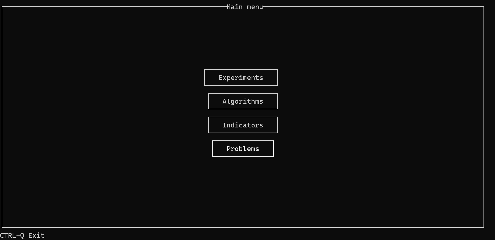
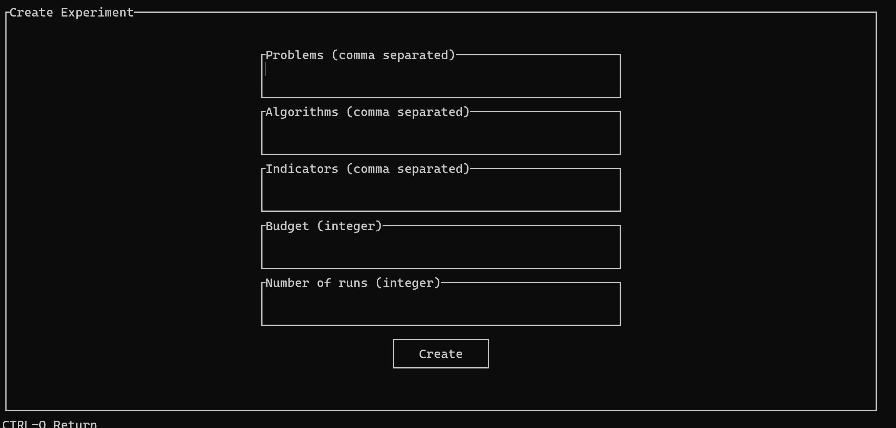
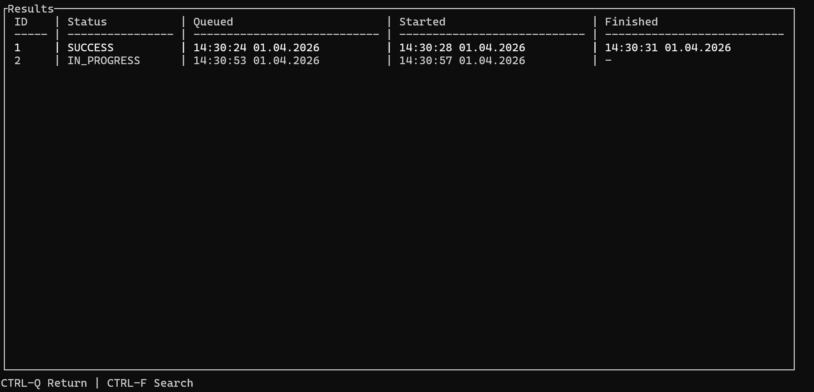
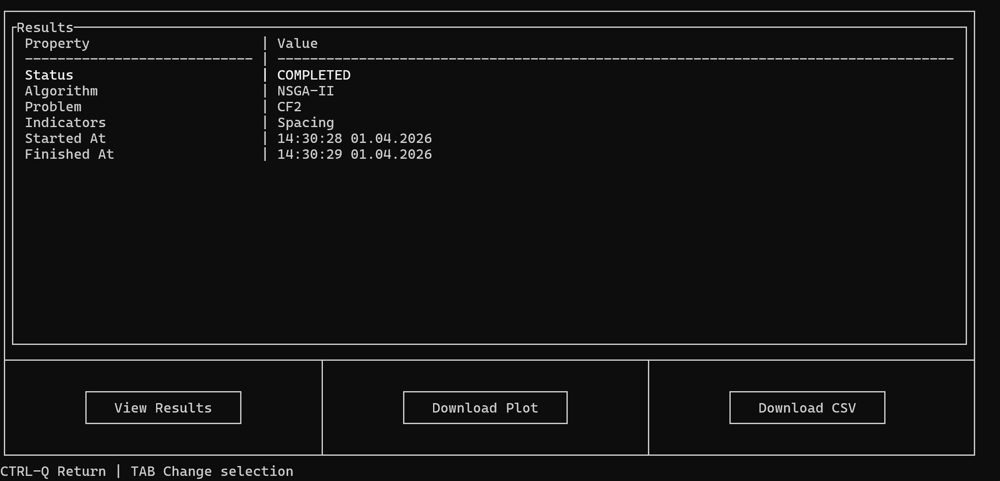

# MOEABench


**MOEABench** is a Spring Boot-based platform for running and managing multi-objective optimization experiments using [MOEAFramework](https://github.com/MOEAFramework/MOEAFramework). It was created as an Technologie Obiektowe (Object-Oriented Technologies) university project at AGH University of Krakow. Project task descriptions for each milestone (in Polish) are available in the `assignment/` folder.

<table>
  <tr>
    <td></td>
    <td></td>
  </tr>
  <tr>
    <td></td>
    <td></td>
  </tr>
</table>

## Key Characteristics

The system supports configuring and executing multi-objective optimization algorithms (e.g. NSGA-II, NSGA-III, eMOEA) against benchmark problems (e.g. DTLZ, ZDT) with configurable performance indicators. Experiments are organized hierarchically: an **ExperimentGroup** contains multiple **Experiments**, each containing **ExperimentParts** that run in parallel asynchronously.

## Notable Capabilities

- Create and run multi-objective optimization experiments with flexible algorithm/problem/indicator configurations
- Asynchronous execution of algorithm runs tracked via status: `QUEUED`, `IN_PROGRESS`, `SUCCESS`, `PARTIAL_SUCCESS`, `FAILED`
- Filter experiments, runs, and parts by status, algorithm, problem, indicators, budget, and date range
- Aggregate results using statistical measures: mean, median, standard deviation
- Delete entire experiment groups or individual experiments and their runs
- Explore available algorithms, problems, and indicators via dedicated REST endpoints
- Interactive terminal UI client with scenario-based navigation

## Running

The easiest way to run the server is via Docker Compose — no Java or PostgreSQL installation required:

```bash
docker compose up
```

This starts a PostgreSQL 17 instance and the server on `http://localhost:8080`.

Alternatively, pull the pre-built server image from GHCR and run it against your own PostgreSQL:

```bash
docker run -e DATABASE_URL=jdbc:postgresql://<host>:<port>/<db>?user=<user>&password=<pass> \
  -p 8080:8080 \
  ghcr.io/pandetthe/moeabench/server:latest
```

The client (TUI) is a native binary — see [Releases](https://github.com/pandetthe/MOEABench/releases) for pre-built binaries for Linux, macOS, and Windows.

The server REST API is available with Swagger UI at `http://localhost:8080/swagger-ui.html`.

## Development

Requires Java 25 and Maven (see `.mise.toml`), plus a running **PostgreSQL** instance for the server module.

```bash
mise install          # install Java 25 via mise

# Build all modules
./mvnw package -DskipTests

# Run tests
./mvnw test

# Run the server
./mvnw spring-boot:run -pl server

# Run the client (interactive TUI)
./mvnw spring-boot:run -pl client

# Build the client as a native executable (requires GraalVM JDK 25)
# Produces client/target/client on Linux/macOS or client\target\client.exe on Windows
./mvnw -Pnative native:compile -pl client -am -DskipTests
```

On Windows use `mvnw.cmd` instead of `./mvnw`. The native executable can be placed directly on your `PATH` and invoked without Java installed.

> **Note:** GraalVM Native Image does not support cross-compilation - each binary must be built on its target OS. Use CI (e.g. GitHub Actions) with an OS matrix to produce all three binaries automatically. On Windows you can also build a Linux binary via Docker + WSL2, but macOS always requires a real Mac machine or CI runner.

To debug the client via an external terminal, run `client-external-console.bat`, wait for it to listen on port `5005`, then attach a `Remote JVM Debug` configuration in your IDE.

